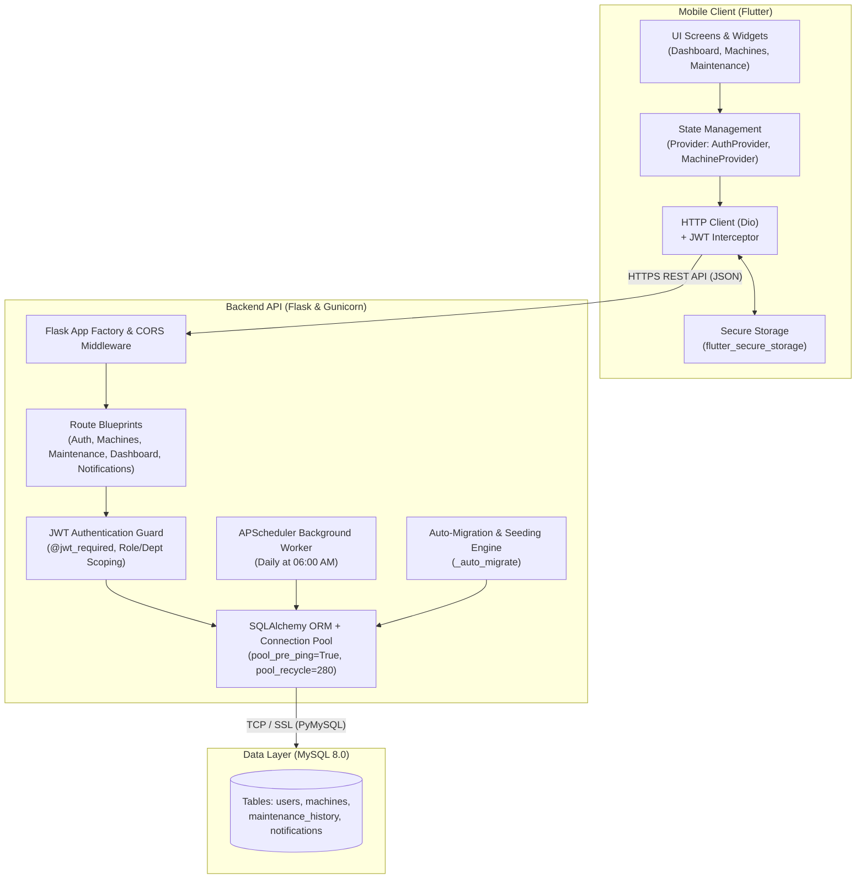

# MaintHub — System Architecture & Design

This document details the architectural principles, component structure, security model, and data flow of the **MaintHub** platform.

---

## 🏛️ System Overview

MaintHub is designed as a decoupled, multi-tier enterprise maintenance management application comprised of a Flutter mobile client, a Python/Flask REST API backend, and a MySQL relational database.



---

## 💻 Backend Architecture (`mainthub-backend`)

### 1. Application Factory Pattern
The backend is structured using Flask's application factory (`create_app()` in `app/__init__.py`), ensuring clean isolation for testing, configuration injection, and modular blueprint registration.

```
mainthub-backend/
├── app/
│   ├── __init__.py           # App factory, DB config, auto-migration, health checks
│   ├── models/               # SQLAlchemy ORM entities
│   │   ├── user.py           # User entity & credentials
│   │   ├── machine.py        # Machine entity & intervals
│   │   ├── maintenance.py    # MaintenanceHistory entity
│   │   └── notification.py   # Notification entity
│   ├── routes/               # Modular REST Blueprints
│   │   ├── auth.py           # Login, registration, token generation
│   │   ├── machines.py       # CRUD & department filtering
│   │   ├── maintenance.py    # Maintenance completion & history
│   │   ├── dashboard.py      # KPI metrics & overdue aggregations
│   │   └── notifications.py  # In-app notifications
│   └── services/
│       └── scheduler.py      # APScheduler background tasks
├── run.py                    # Entry point for development / gunicorn
├── seed.py                   # 295 machine catalog seeds across 6 departments
├── Dockerfile                # Container definition
├── Procfile                  # Gunicorn definition for Render/Heroku
└── render.yaml               # Infrastructure-as-code deployment manifest
```

### 2. Connection Resilience & Auto-Migration
To prevent common cloud timeouts (e.g. idle socket termination by Railway or Render after 5 minutes):
- `pool_pre_ping: True` tests socket viability before executing queries.
- `pool_recycle: 280` recycles connections before cloud timeout windows.
- SQLite auto-fallback engages automatically if local MySQL is unreachable during offline development.
- `_auto_migrate(app)` verifies column structure (`department`, `is_active`) and seeds missing machines dynamically on boot.

---

## 📱 Mobile Architecture (`mainthub-app`)

The mobile client is built with Flutter using a layered architecture:

```
mainthub-app/lib/
├── config/
│   ├── app_config.dart       # API base URL & runtime flags
│   └── theme.dart            # Material Design 3 palette & styling
├── models/
│   ├── user.dart             # User model with department label logic
│   ├── machine.dart          # Machine model with overdue calculation
│   └── dashboard.dart        # KPI summary data structures
├── providers/                # ChangeNotifier state stores
│   ├── auth_provider.dart    # Auth state, login/logout, role caching
│   └── machine_provider.dart # Machine list, filtering, CRUD state
├── services/                 # Remote API connectors
│   ├── api_client.dart       # Dio HTTP singleton with Bearer token interceptor
│   ├── auth_service.dart     # Auth endpoint calls & secure persistence
│   ├── machine_service.dart  # Machine catalog & maintenance calls
│   └── dashboard_service.dart# Metric aggregations
└── screens/                  # UI Views
    ├── auth/                 # Splash & Login screens
    ├── dashboard/            # KPI overview & overdue cards
    ├── machines/             # Machine list, machine detail, add machine
    └── maintanance/          # Pending maintenance & completion screens
```

### State Management & Lifecycle
- **Provider Pattern:** Keeps UI cleanly separated from business logic.
- **Auto-Authentication Check:** `SplashScreen` verifies saved JWT tokens in `flutter_secure_storage`. If valid, fetches user identity and transitions to `DashboardScreen`.
- **Department Scoping:** The UI adapts dynamically based on user role. Technicians see a focused view of their assigned department, while Admins receive a department selector tab.

---

## 👥 Multi-Department & Role-Based Access Control (RBAC)

The system enforces strict role-based access control combined with textile mill department scoping:

| Capability | Administrator (`ADMIN`) | Technician (`TECHNICIAN`) |
|------------|------------------------|---------------------------|
| **Department Scope** | Cross-department (All 6 departments) | Assigned Department Only |
| **Department Switching** | ✅ Filter by any department | ❌ Locked to assigned department |
| **View Dashboard & KPIs** | ✅ Global or filtered KPIs | ✅ Department-specific KPIs |
| **View Machine List** | ✅ All 295 machines | ✅ Department machines only |
| **Add New Machines** | ✅ Allowed | ❌ Forbidden (`403 Forbidden`) |
| **Update Machine Info** | ✅ Allowed | ❌ Forbidden (`403 Forbidden`) |
| **Delete Machines** | ✅ Allowed | ❌ Forbidden (`403 Forbidden`) |
| **Mark Maintenance Done** | ✅ Allowed | ✅ Allowed (Updates schedule) |
| **View Maintenance Log** | ✅ Allowed | ✅ Allowed |
| **Receive Notifications** | ✅ System notifications | ✅ Department overdue alerts |

---

## ⏰ Background Scheduler & Notification Engine

MaintHub features a non-blocking background scheduler powered by `APScheduler`:

1. **Daily Execution:** Runs every morning at **06:00 AM**.
2. **Evaluation Query:** Queries all active machines where `next_maintenance_date <= TODAY()`.
3. **Alert Generation:**
   - Machines with `next_maintenance_date < TODAY()` are flagged as `OVERDUE`.
   - Machines with `next_maintenance_date == TODAY()` are flagged as `REMINDER`.
4. **Targeted Dispatch:** Generates in-app notification rows in the database for all relevant technicians assigned to the machine's department.
5. **Real-time Recalculation:** When a technician completes maintenance, the backend resets status to `ACTIVE`, logs the completion in `maintenance_history`, and recalculates `next_maintenance_date = today + maintenance_interval`.

---

## 🔒 Security Model

1. **Password Protection:** Passwords are never stored in plaintext. They are salted and hashed using `bcrypt`.
2. **Stateless JWT Tokens:** Authentication tokens are issued via `Flask-JWT-Extended` with customizable secret keys and expiry.
3. **Secure Mobile Storage:** On Android, tokens are encrypted and kept in KeyStore-backed `flutter_secure_storage`.
4. **CORS Hardening:** Configured via `flask-cors` to govern allowed cross-origin requests.
5. **SQL Injection Prevention:** All database operations utilize SQLAlchemy ORM parameterized queries or bound parameters.
