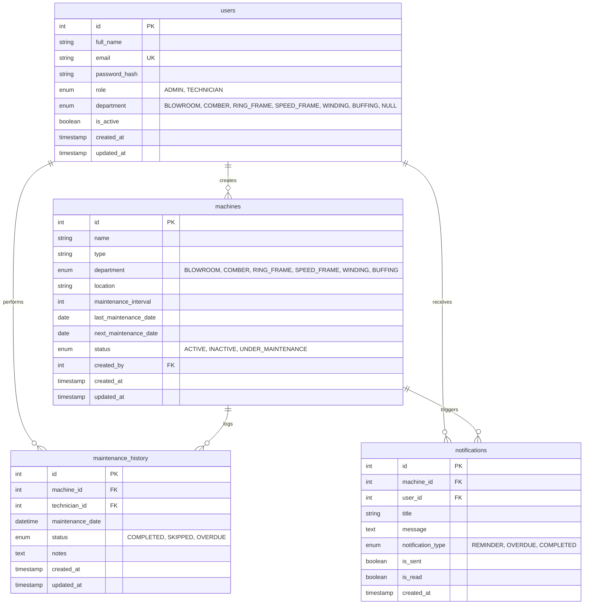

# MaintHub — Database Schema & Architecture

This document specifies the database architecture, table definitions, entity relationships, indexes, enums, and auto-migration mechanisms for the **MaintHub** system.

---

## 🏗️ Entity Relationship Diagram

---

## 🗄️ Detailed Table Specifications

### 1. `users` Table
Stores authentication credentials, user roles, and department assignments.

| Column | Data Type | Nullable | Default | Description |
|--------|-----------|----------|---------|-------------|
| `id` | `INT AUTO_INCREMENT` | No | Primary Key | Unique user identifier |
| `full_name` | `VARCHAR(255)` | No | — | Full name of the user |
| `email` | `VARCHAR(255)` | No | Unique | Email address used for login |
| `password_hash` | `VARCHAR(255)` | No | — | BCrypt password hash |
| `role` | `ENUM('ADMIN', 'TECHNICIAN')` | No | `'TECHNICIAN'` | User access tier |
| `department` | `ENUM('BLOWROOM', 'COMBER', 'RING_FRAME', 'SPEED_FRAME', 'WINDING', 'BUFFING')` | Yes | `NULL` | Department scoping. `NULL` denotes Admin (access to all departments). Required for Technicians. |
| `is_active` | `BOOLEAN` | No | `TRUE` | Account active state |
| `created_at` | `TIMESTAMP` | No | `CURRENT_TIMESTAMP` | Account creation timestamp |
| `updated_at` | `TIMESTAMP` | No | `CURRENT_TIMESTAMP ON UPDATE` | Last profile update timestamp |

**Indexes:**
- `PRIMARY KEY (id)`
- `UNIQUE INDEX idx_users_email (email)`

---

### 2. `machines` Table
Maintains machinery inventory across textile departments, maintenance intervals, and calculated due dates.

| Column | Data Type | Nullable | Default | Description |
|--------|-----------|----------|---------|-------------|
| `id` | `INT AUTO_INCREMENT` | No | Primary Key | Unique machine identifier |
| `name` | `VARCHAR(255)` | No | — | Machine designation/code (e.g. `B-01 Bale Opener`, `RF-12`) |
| `type` | `VARCHAR(100)` | No | — | Machine category (e.g. `Carding`, `Comber`, `Ring Frame`) |
| `department` | `ENUM('BLOWROOM', 'COMBER', 'RING_FRAME', 'SPEED_FRAME', 'WINDING', 'BUFFING')` | No | `'BLOWROOM'` | Department where machine operates |
| `location` | `VARCHAR(255)` | Yes | `NULL` | Mill location / shed / line |
| `maintenance_interval` | `INT` | No | — | Service cycle duration in days |
| `last_maintenance_date` | `DATE` | Yes | `NULL` | Date of last completed service |
| `next_maintenance_date` | `DATE` | No | — | Scheduled date for next service |
| `status` | `ENUM('ACTIVE', 'INACTIVE', 'UNDER_MAINTENANCE')` | No | `'ACTIVE'` | Machine operational status |
| `created_by` | `INT` | No | Foreign Key | User ID of administrator who added machine |
| `created_at` | `TIMESTAMP` | No | `CURRENT_TIMESTAMP` | Record creation timestamp |
| `updated_at` | `TIMESTAMP` | No | `CURRENT_TIMESTAMP ON UPDATE` | Record modification timestamp |

**Foreign Keys & Cascades:**
- `CONSTRAINT fk_machine_created_by FOREIGN KEY (created_by) REFERENCES users(id)`

**Indexes:**
- `PRIMARY KEY (id)`
- `INDEX idx_machines_status (status)`
- `INDEX idx_machines_next_date (next_maintenance_date)`
- `INDEX idx_machines_created_by (created_by)`
- `INDEX idx_machines_department (department)`

---

### 3. `maintenance_history` Table
Immutable audit log of maintenance operations completed or recorded.

| Column | Data Type | Nullable | Default | Description |
|--------|-----------|----------|---------|-------------|
| `id` | `INT AUTO_INCREMENT` | No | Primary Key | Unique history log identifier |
| `machine_id` | `INT` | No | Foreign Key | Machine serviced |
| `technician_id` | `INT` | No | Foreign Key | User who carried out the maintenance |
| `maintenance_date` | `DATETIME` | No | — | Timestamp when maintenance was completed |
| `status` | `ENUM('COMPLETED', 'SKIPPED', 'OVERDUE')` | No | `'COMPLETED'` | Status outcome |
| `notes` | `TEXT` | Yes | `NULL` | Detailed notes, parts replaced, observations |
| `created_at` | `TIMESTAMP` | No | `CURRENT_TIMESTAMP` | Record creation timestamp |
| `updated_at` | `TIMESTAMP` | No | `CURRENT_TIMESTAMP ON UPDATE` | Record update timestamp |

**Foreign Keys & Cascades:**
- `CONSTRAINT fk_history_machine FOREIGN KEY (machine_id) REFERENCES machines(id) ON DELETE CASCADE`
- `CONSTRAINT fk_history_technician FOREIGN KEY (technician_id) REFERENCES users(id)`

**Indexes:**
- `PRIMARY KEY (id)`
- `INDEX idx_history_machine_id (machine_id)`
- `INDEX idx_history_technician_id (technician_id)`
- `INDEX idx_history_date (maintenance_date)`
- `INDEX idx_history_status (status)`

---

### 4. `notifications` Table
In-app notification alerts generated by the scheduler or maintenance events.

| Column | Data Type | Nullable | Default | Description |
|--------|-----------|----------|---------|-------------|
| `id` | `INT AUTO_INCREMENT` | No | Primary Key | Unique notification identifier |
| `machine_id` | `INT` | No | Foreign Key | Target machine |
| `user_id` | `INT` | No | Foreign Key | Recipient user |
| `title` | `VARCHAR(255)` | No | — | Alert headline |
| `message` | `TEXT` | No | — | Alert detail message |
| `notification_type` | `ENUM('REMINDER', 'OVERDUE', 'COMPLETED')` | No | `'REMINDER'` | Alert classification |
| `is_sent` | `BOOLEAN` | No | `FALSE` | Delivery status flag |
| `is_read` | `BOOLEAN` | No | `FALSE` | Read acknowledgement flag |
| `created_at` | `TIMESTAMP` | No | `CURRENT_TIMESTAMP` | Dispatch timestamp |

**Foreign Keys & Cascades:**
- `CONSTRAINT fk_notif_machine FOREIGN KEY (machine_id) REFERENCES machines(id) ON DELETE CASCADE`
- `CONSTRAINT fk_notif_user FOREIGN KEY (user_id) REFERENCES users(id) ON DELETE CASCADE`

**Indexes:**
- `PRIMARY KEY (id)`
- `INDEX idx_notif_user_id (user_id)`
- `INDEX idx_notif_machine_id (machine_id)`
- `INDEX idx_notif_type (notification_type)`
- `INDEX idx_notif_created_at (created_at)`
- `INDEX idx_notif_is_read (is_read)`

---

## ⚙️ Automated Migration & Seeding Engine

When the Flask backend starts (`app/__init__.py`), it executes `_auto_migrate(app)` inside the application context:

1. **Schema Self-Healing:**
   - Detects if `department` or `is_active` columns are missing on `users` or `machines` tables and applies `ALTER TABLE` automatically.
2. **Default Admin Seeding:**
   - Ensures `admin@mainthub.com` exists with BCrypt-hashed credentials (`admin123`).
3. **Machine Catalog Synchronization:**
   - Compares existing database machines against `seed.py` (295 machines across 6 departments).
   - Inserts any missing machines automatically without duplicating existing records.
